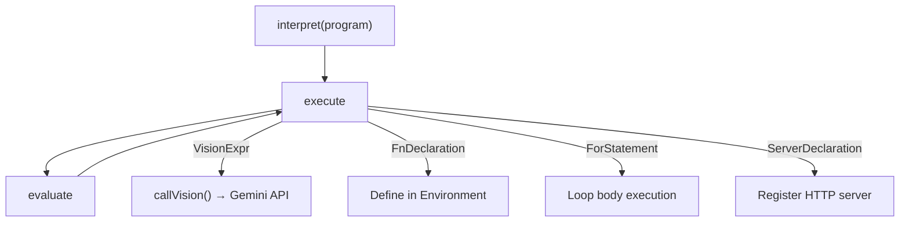
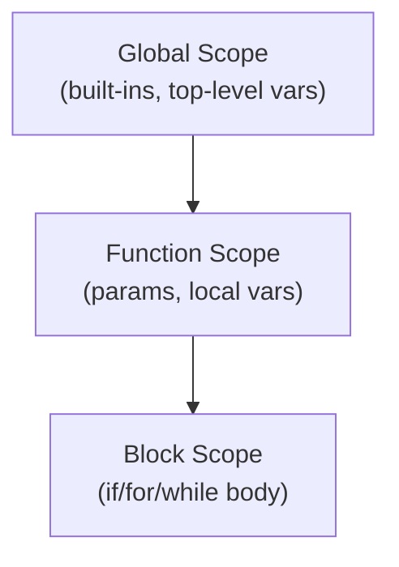

# Interpreter

The interpreter is a **tree-walking evaluator** that traverses the AST and executes each node. It is the heart of the Lythra runtime.

## Core Loop

The interpreter has two main methods:

- **`execute(stmt)`** — Handles statements (declarations, control flow, blocks)
- **`evaluate(expr)`** — Handles expressions (returns a `LythraValue`)



## Environment & Scoping

Variables are stored in an `Environment` — a linked chain of scopes that supports lexical nesting.



- `let` / `const` declarations create bindings in the current scope
- Variable lookup walks up the scope chain
- Closures capture their enclosing environment

## Value Types

All runtime values are represented as `LythraValue`:

```typescript
type LythraValue =
  | string
  | number
  | boolean
  | null
  | LythraValue[]
  | { [key: string]: LythraValue }
  | LythraCallable;
```

## Vision Call Evaluation

When the interpreter encounters a `VisionExpr`:

1. Evaluates the prompt expression (resolving interpolations)
2. Evaluates the context expression (`using` / `from`), if present
3. Determines the temperature from the active modifier block
4. Checks the cache (if inside a `remember` block)
5. Calls the Gemini API via `callVision()`
6. Coerces the raw text response to the declared type (`String`, `Int`, `Float`, `Boolean`, `Object`, arrays)
7. Stores in cache (if applicable)
8. Returns the typed value

## Special Control Flow

The interpreter uses exception-based control flow for:

- **`ReturnEx`** — thrown by `return` statements, caught by function/pipeline callers
- **`HaltEx`** — thrown by `halt`, terminates the program
- **`AssertionEx`** — thrown by failed `assert` statements, caught by `attempt` blocks

## Server Execution

When a `ServerDeclaration` is encountered:

1. An Express server is created and registered
2. `ChannelDeclaration` nodes register route handlers
3. `FilterDeclaration` nodes register middleware
4. `open doors` starts listening on the declared port
5. `MethodHandler` nodes (e.g., `on call GET`) define the request handling logic

## Parallel Execution

`ParallelBlock` nodes collect all `vision` calls in the block body and execute them concurrently using `Promise.all()`. Results are assigned to their respective variables once all parallel calls complete.
