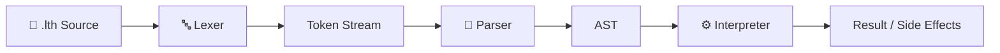
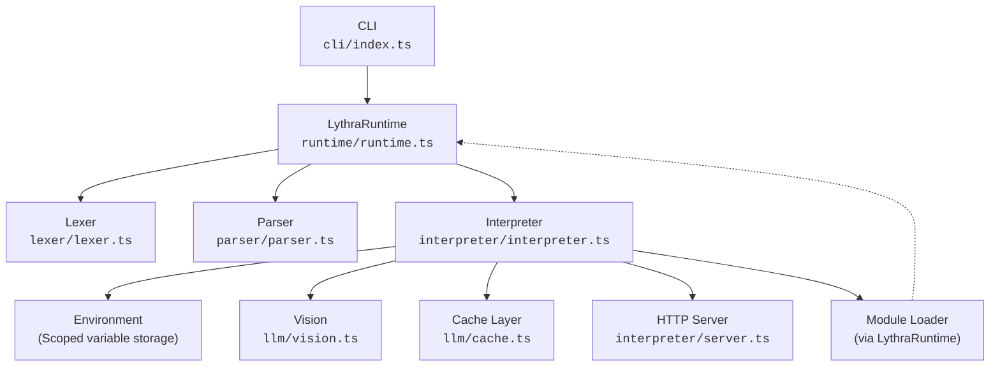
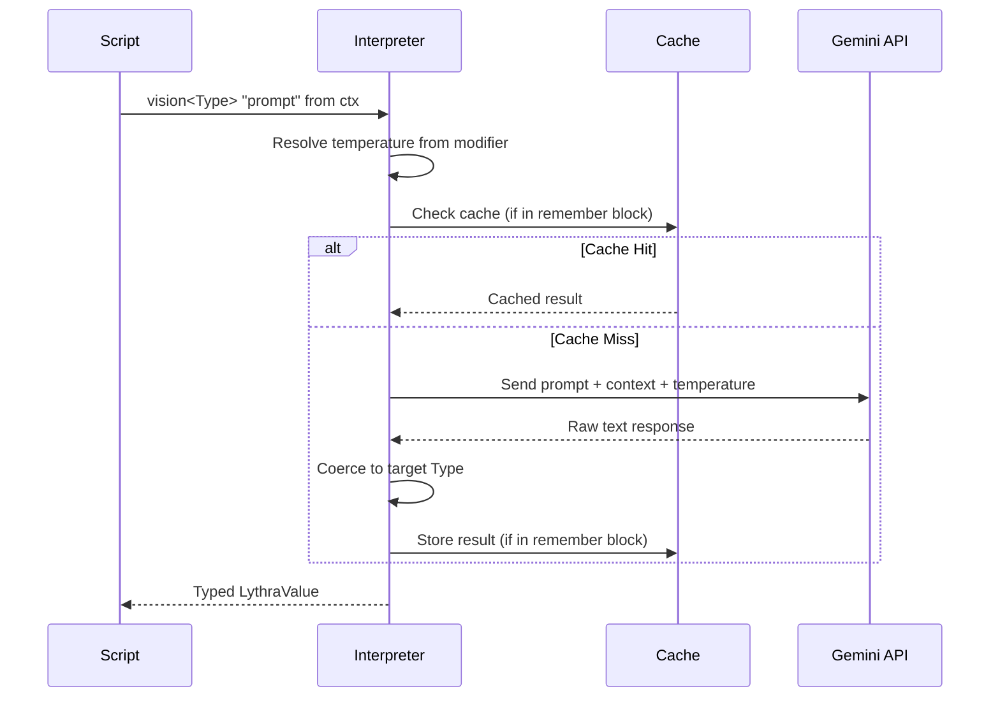
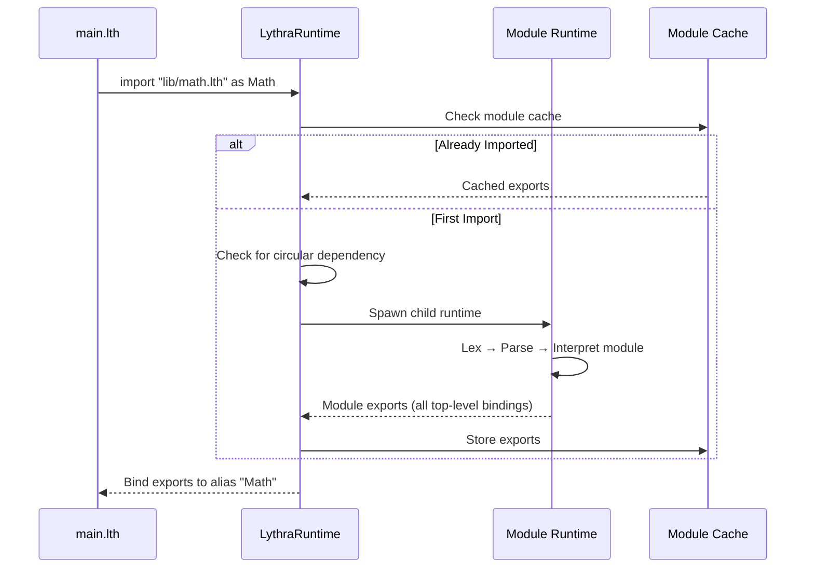

# Architecture Overview

This section describes the internal architecture of the Lythra interpreter. Lythra follows a traditional **Lexer → Parser → Interpreter** pipeline, with added layers for LLM integration, caching, and module resolution.

## Execution Pipeline

When you run `lythra run script.lth`, the following stages execute:



1. **Lexer** — Converts raw source text into a stream of tokens
2. **Parser** — Converts tokens into an Abstract Syntax Tree (AST)
3. **Interpreter** — Tree-walks the AST, evaluating expressions and executing statements

## System Architecture



### Key Components

| Component | File | Responsibility |
|---|---|---|
| **CLI** | `src/cli/index.ts` | Entry point, argument parsing, loads `lythra.json` |
| **Runtime** | `src/runtime/runtime.ts` | Orchestrates lex → parse → interpret, handles imports |
| **Lexer** | `src/lexer/lexer.ts` | Tokenization with line/column tracking |
| **Parser** | `src/parser/parser.ts` | Recursive-descent parser, produces AST |
| **AST** | `src/parser/ast.ts` | Immutable node type definitions |
| **Interpreter** | `src/interpreter/interpreter.ts` | Tree-walking evaluator |
| **Environment** | `src/interpreter/environment.ts` | Scoped variable storage (nested closures) |
| **Vision** | `src/llm/vision.ts` | Gemini API integration, type coercion |
| **Cache** | `src/llm/cache.ts` | Prompt-keyed response caching |
| **Server** | `src/interpreter/server.ts` | Express-based HTTP server management |

## Vision Call Flow

This sequence diagram shows what happens when a `vision<Type>` call is evaluated:



## Module Resolution Flow



## Directory Structure

```
src/
├── cli/
│   ├── index.ts          # CLI entry point & command routing
│   └── repl.ts           # Interactive REPL
├── lexer/
│   ├── lexer.ts          # Tokenizer
│   └── token.ts          # Token type definitions
├── parser/
│   ├── parser.ts         # Recursive-descent parser
│   └── ast.ts            # AST node interfaces
├── interpreter/
│   ├── interpreter.ts    # Tree-walking evaluator
│   ├── environment.ts    # Scoped variable storage
│   ├── types.ts          # LythraValue, RuntimeError, etc.
│   └── server.ts         # HTTP server manager
├── llm/
│   ├── vision.ts         # Gemini API client
│   └── cache.ts          # Prompt-keyed caching
└── runtime/
    ├── runtime.ts        # Orchestrator (lex → parse → interpret)
    └── errors.ts         # Error formatting with source snippets
```

## Deep Dives

- [Lexer](./lexer) — Tokenization details
- [Parser](./parser) — AST construction and grammar
- [Interpreter](./interpreter) — Evaluation and runtime semantics
