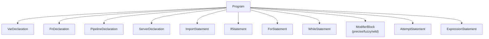

# Parser

The parser converts the token stream from the lexer into an **Abstract Syntax Tree (AST)**. Lythra uses a hand-written **recursive-descent parser**.

## Grammar Overview

The parser handles the following top-level constructs:



## AST Node Types

All AST nodes are defined in `src/parser/ast.ts` as readonly TypeScript interfaces. Every node carries `line` and `column` for error reporting.

### Expressions

| Node | Description |
|---|---|
| `NumberLiteral` | Numeric values: `42`, `3.14` |
| `StringLiteral` | Plain strings: `"hello"` |
| `InterpolatedStringExpr` | Template strings: `"hello {name}"` |
| `BooleanLiteral` | `true` / `false` |
| `NullLiteral` | `null` |
| `Identifier` | Variable references |
| `BinaryExpr` | `a + b`, `x == y` |
| `UnaryExpr` | `-x`, `not flag` |
| `CallExpr` | `add(1, 2)` |
| `MemberExpr` | `obj.field` |
| `ComputedMemberExpr` | `arr[0]` |
| `ArrayLiteral` | `[1, 2, 3]` |
| `ObjectLiteral` | `{ name: "a" }` |
| `VisionExpr` | `vision<Type> "prompt" from ctx` |
| `NativeMethodExpr` | `arr contains 5`, `str matches "..."` |
| `NativePropertyExpr` | `arr length` |
| `FetchExpr` | `fetch url as json` |
| `EnvAccessExpr` | `env.VAR` |
| `ReadlineExpr` | `readline "prompt"` |

### Statements

| Node | Description |
|---|---|
| `VarDeclaration` | `let x = 10`, `const y = 20` |
| `Assignment` | `x = x + 1` |
| `LogStatement` | `log "hello"` |
| `HaltStatement` | `halt "error"` |
| `IfStatement` | `if ... else if ... else` |
| `WhileStatement` | `while condition:` |
| `ForStatement` | `for item in list:` |
| `ReturnStatement` | `return value` |
| `FnDeclaration` | `fn name(params) -> Type:` |
| `PipelineDeclaration` | `pipeline Name(params) -> Type:` |
| `ServerDeclaration` | `server Name on port:` |
| `ChannelDeclaration` | `channel "/path":` |
| `FilterDeclaration` | `filter all:` / `filter "/path":` |
| `MethodHandler` | `on call GET:` |
| `ModifierBlock` | `precise:` / `fuzzy:` / `wild:` |
| `AttemptStatement` | `attempt N times:` |
| `RememberBlock` | `remember:` |
| `ParallelBlock` | `parallel:` |
| `ImportStatement` | `import "path" as Alias` |

## Error Recovery

Like the lexer, the parser collects errors without stopping. It returns both the parsed `Program` and any errors:

```typescript
const { program, errors } = parse(tokens);
```
